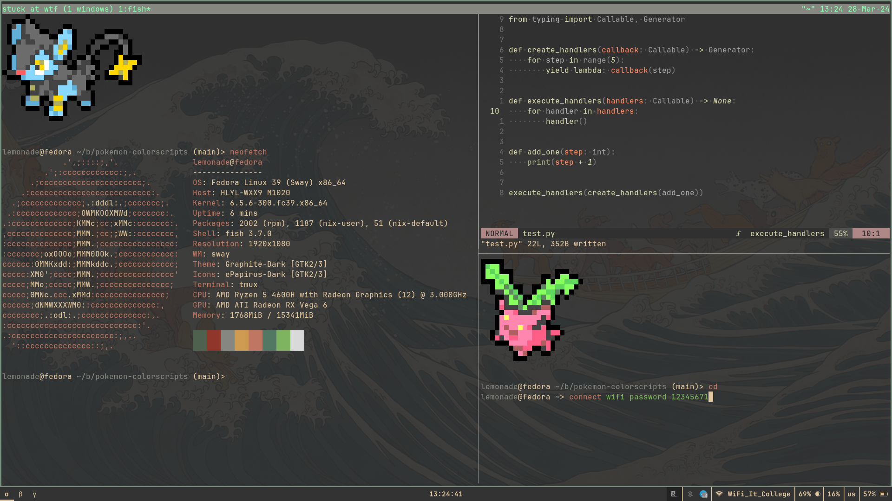

# My dots
Goblincore style, may look strange because of me being deutan
## Info
- editor: nvim (kanagawabones)
- gtk: adwaita
- terminal: alacritty + tmux
- wm: sway (regular), hyprland, bspwm (by mood)
- shell: fish
- ls: [g](https://github.com/Equationzhao/g)
- finder: rofi (cfg stolen from reddit, link in file)
- browser: chromium

> dirs are ment to be linked into $XDG_CONFIG_HOME, e.g. via my managedots script, or manually

yes, whole workflow is tmux + neovim
